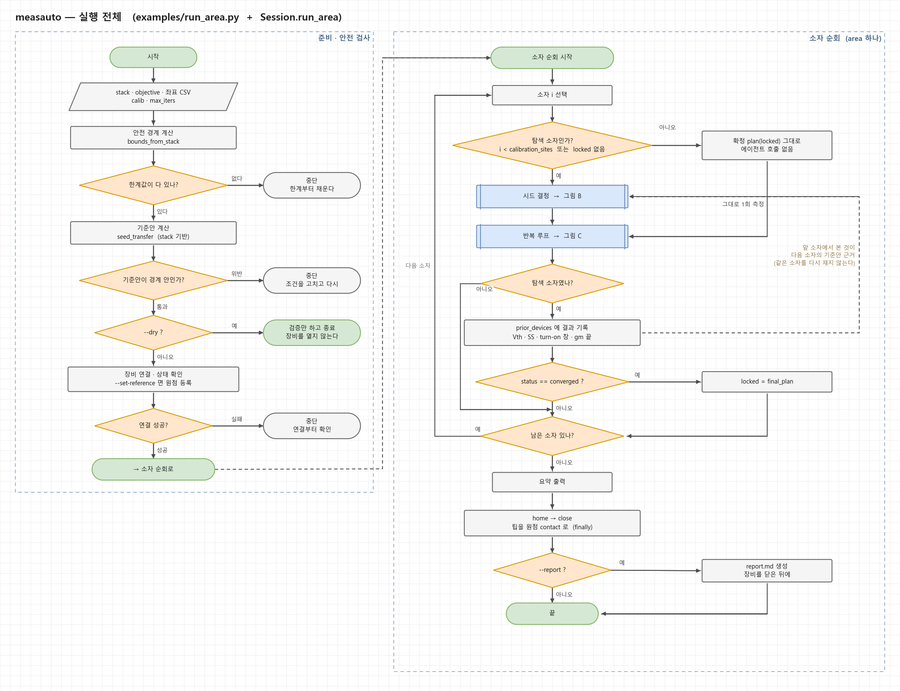
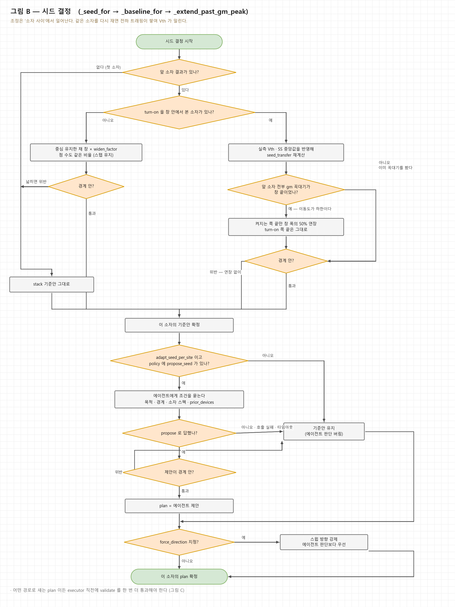
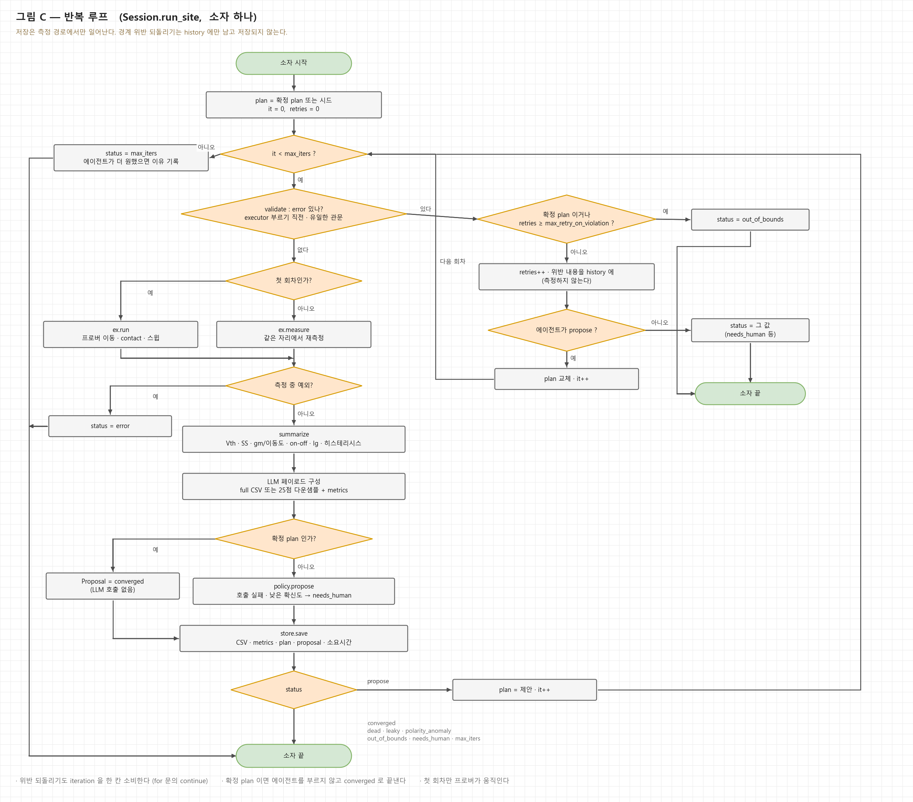
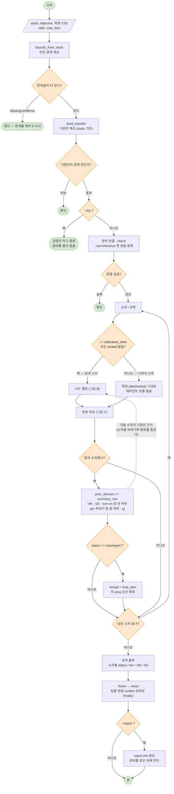
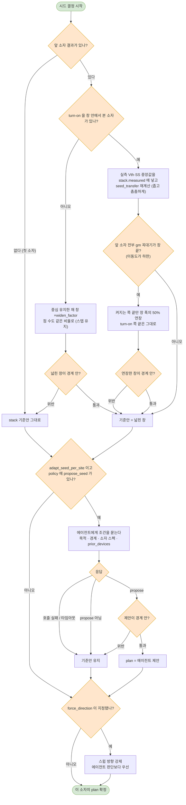
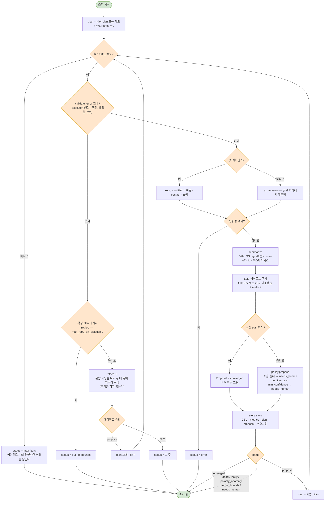

# measauto 실행 순서도

`measauto/examples/run_area.py` → `Session.run_area` → `Session.run_site` 의 실제 분기를
그대로 옮긴 것. 세 장으로 나눈다.

| 그림 | 내용 | 파일 |
|---|---|---|
| A | 실행 전체 — 준비 · 안전 검사 · 소자 순회 · 마무리 | [PNG](flow/measauto_flow_a_overview.png) · [SVG](flow/measauto_flow_a_overview.svg) |
| B | 시드 결정 — 이 소자의 조건을 무엇을 근거로 정하는가 | [PNG](flow/measauto_flow_b_seed.png) · [SVG](flow/measauto_flow_b_seed.svg) |
| C | 반복 루프 — 소자 하나 안에서 도는 루프 | [PNG](flow/measauto_flow_c_iteration.png) · [SVG](flow/measauto_flow_c_iteration.svg) |

그림을 고치려면 `docs/flow/src/` 의 스크립트를 고치고 다시 돌린다 (matplotlib 만 있으면 된다).

```
cd docs/flow/src && python dia_a.py && python dia_b.py && python dia_c.py
```

---

## A. 실행 전체 (`run_area.py` + `Session.run_area`)



## B. 시드 결정 (`_seed_for` → `_baseline_for` → `_extend_past_gm_peak`)

초안의 `Generate Seed Conditions` 한 칸이 실제로는 이만큼이다. 조정이 **소자 사이**에서
일어나는 게 이 설계의 핵심이라 접어두면 안 된다 — 같은 소자를 다시 재면 트래핑이 쌓인다.



## C. 반복 루프 (`Session.run_site`)

초안의 오른쪽 판. 빠져 있던 것: 반복 상한, 위반 재시도 상한, 측정 예외, 첫 회차와
이후 회차의 차이, status 가 7가지라는 점, 저장 시점.



---
## 초안에서 채운 것

| 초안 | 실제 |
|---|---|
| `Calibration Device?` 의 No 분기 없음 | 확정 plan(locked)으로 1회만 측정, 에이전트 호출 없음 |
| `More Devices?` 의 Yes 분기 없음 | 다음 소자로 되돌아감 |
| 루프 종료 조건이 verdict 뿐 | `max_iters` 상한, 측정 예외, 7가지 status |
| 위반 되돌리기가 무한 | `max_retry_on_violation` 상한 → `out_of_bounds`, 재시도도 iteration 을 소비 |
| `Move Probe, Run Sweep` 한 칸 | 첫 회차만 프로버 이동(`ex.run`), 이후는 같은 자리 재측정(`ex.measure`) |
| 소자 간 학습 경로 없음 | `prior_devices` → 다음 소자 기준안 (창 확대 / 실측 반영 / gm 꼭대기 연장) |
| 마무리 없음 | 요약 · `home`/`close` (finally) · 리포트는 장비 닫은 뒤 |
| 시작부 없음 | 경계 계산 · 기준안 검증 · `--dry` · 연결 실패 |

초안 오른쪽 아래 `Verdict = propose new conditions?` 의 Yes 상자가 `Send violation back` 으로
잘못 붙어 있다 — 그 자리는 "제안된 조건으로 교체"다. 위반 되돌리기는 위쪽 경로다.

---

## 부록 — 같은 그림의 mermaid 원본

draw.io 로 옮겨 손으로 편집하려면 **Arrange ▸ Insert ▸ Advanced ▸ Mermaid** 에 붙여넣는다.

### A. 실행 전체 (`run_area.py` + `Session.run_area`)



---

### B. 시드 결정 (`_seed_for` → `_baseline_for` → `_extend_past_gm_peak`)

초안의 `Generate Seed Conditions` 한 칸이 실제로는 이만큼이다. 조정이 **소자 사이**에서
일어나는 게 이 설계의 핵심이라 접어두면 안 된다 — 같은 소자를 다시 재면 트래핑이 쌓인다.



---

### C. 반복 루프 (`Session.run_site`)

초안의 오른쪽 판. 빠져 있던 것: 반복 상한, 위반 재시도 상한, 측정 예외, 첫 회차와
이후 회차의 차이, status 가 7가지라는 점, 저장 시점.



---

