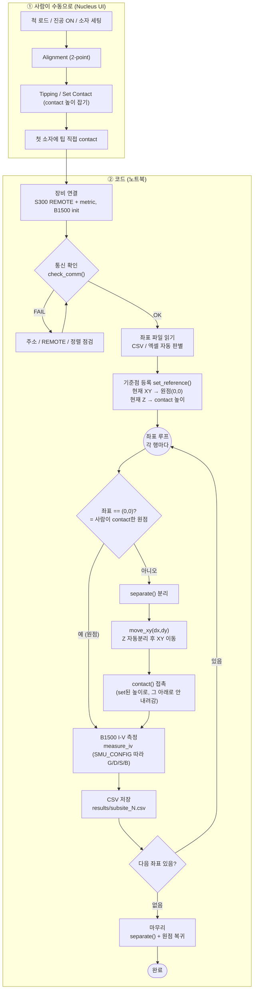

# Grid Measure — 동작 흐름도 (Flow Chart)

S300 프로버(좌표 이동) + B1500A(I-V 측정) 통합 측정 흐름.
노트북 [grid_measure.ipynb](grid_measure.ipynb) 의 셀 순서와 1:1 대응.



## 핵심 포인트

| 단계 | 무엇을 / 왜 |
|---|---|
| **수동 준비** | align·tipping·set contact·첫 소자 contact 는 코드가 대체 안 함 (전제) |
| **통신 확인** | S300·B1500 둘 다 응답 + S300 REMOTE/정렬 상태 확인. OK 떠야 진행 |
| **기준점 등록** | 사람이 contact시킨 위치를 원점(0,0)·contact 높이로 등록 → 이후 소자 안 찍힘 |
| **(0,0) 분기** | 좌표 (0,0) = 원점 = 이미 contact → 이동 없이 측정 (그 외만 이동) |
| **이동 안전성** | `move_xy`는 Z를 안전높이로 자동 분리 후 XY 이동 (이동 중 안 긁힘) / `contact`는 set 높이 아래로 안 내려감 |
| **팁 역할** | `SMU_CONFIG`로 팁(SMU)별 Gate/Drain/Source/Bulk = sweep/const/off 선택 |

---

### (참고) 텍스트 버전

```
[수동 준비: 척/진공/align/tipping/첫 소자 contact]
        │
        ▼
[장비 연결] ──▶ [통신 확인]──FAIL──▶[점검]──┐
                    │ OK                    │
                    ▼                       └──(재확인)
              [좌표 파일 읽기 (CSV/엑셀)]
                    │
                    ▼
          [기준점 등록: 현재위치=원점(0,0)+contact높이]
                    │
                    ▼
        ┌───────[ 좌표 루프: 각 행 ]◀──────────┐
        │            │                         │
        │      좌표 ==(0,0)? ──예──┐           │
        │            │ 아니오       │           │
        │            ▼             │           │
        │     [separate 분리]      │           │
        │            ▼             │           │
        │  [move_xy 이동(Z자동분리)]│           │
        │            ▼             │           │
        │     [contact 접촉]       │           │
        │            ▼             ▼           │
        │        [B1500 I-V 측정]              │
        │            ▼                         │
        │      [CSV 저장 subsite_N.csv]        │
        │            ▼                         │
        │       다음 좌표? ──있음──────────────┘
        │            │ 없음
        ▼            ▼
   [마무리: separate + 원점 복귀] ──▶ [완료]
```
